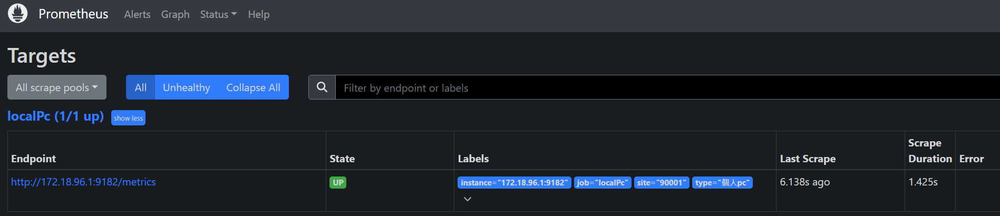
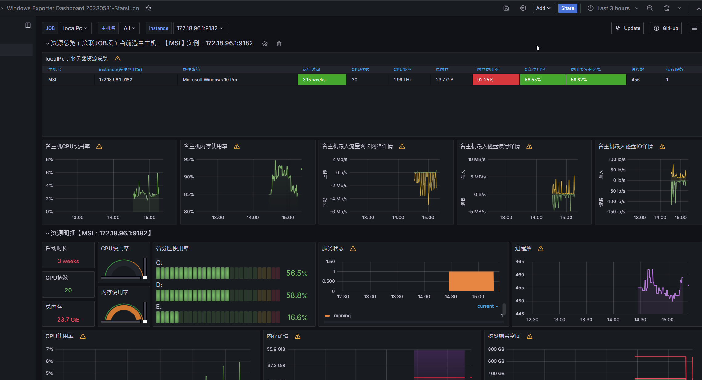

# Prometheus & windowsExporter & PushGateway

## 需求
  收集&監控Windows PC上各個指標(ram,disk...等)
## 步驟
1. 目標電腦部署WindowsExport([readme](./exporter_install.md))
2. 安裝Prometheus
    * 透過docker
    *  注意會是prom主動去打目標電腦的api去撈資料,所以設定--net設成host方便測試,測試完成可以加上-d或改用docker compose
    ```shell
    docker run \
        -p 9090:9090 \
        -v /home/jacky/dockerCmd/prometheus/config/:/etc/prometheus/ \
        -v /home/jacky/dockerCmd/prometheus/data/:/prometheus \
        --name prom \
        --net=host \
        --rm \
      prom/prometheus
    ````
3. 設定prom(參考[yaml](./prom/prometheus.yml))
    +  這裡有兩種設定方法
        1. 共用job,只要把ip寫在另一個文件上[scrape_local.yaml](./prom/scrape_local.yml)
            ``` yaml
            scrape_configs:
            - job_name: "prometheus"
              basic_auth:
                  username: "user"
                  password: "userpwd"
              file_sd_configs:
                - files:
                    - /etc/prometheus/scrape*.yml
                  refresh_interval: 10m
            ```
        2. 分開job,可以更詳細設定[job_local.yaml](./prom/job_local.yml)
            * 但有修改時,要重啟prometheus服務重新讀取
            ``` yaml
            scrape_config_files:
                - /etc/prometheus/job*.yml
            ```
4. 重啟prometheus服務重新讀取(或是透過hot reload)
5. 根據需求設定[Gateway](./pushGateway.md)

在Target會看到有endpoint了

在grafana中找一個支援windowsExporter的dashboard匯入就可以看到各項指標
